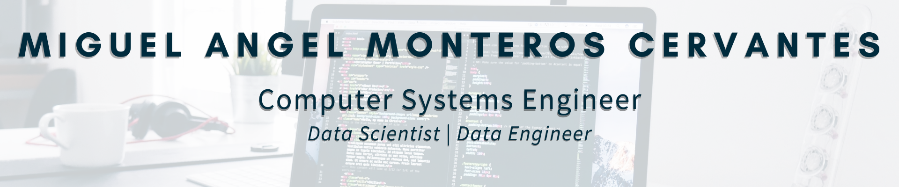
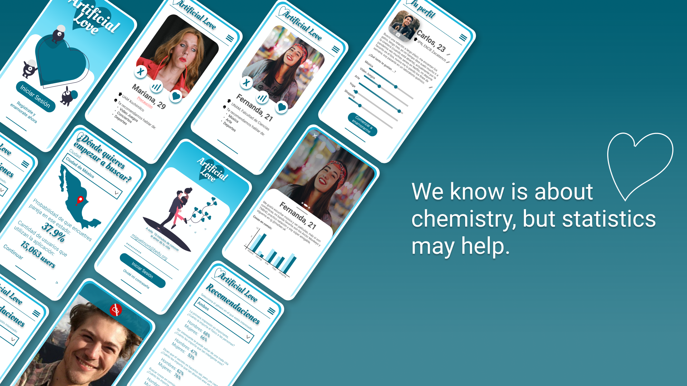
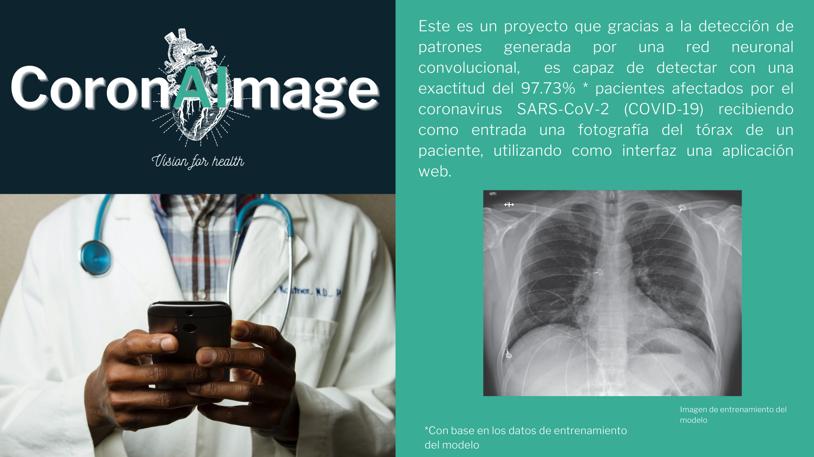
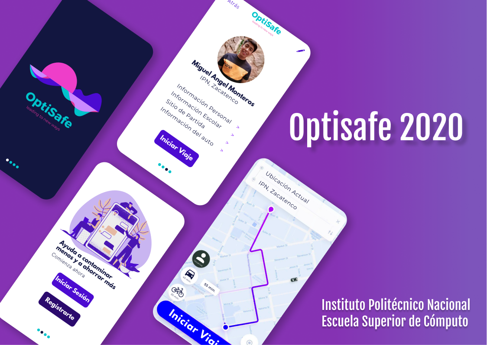

  

### 👨‍🎓 About Me 👨‍🎓
There are many things that I love to do, but learning about IT is the most important one, I've been studying by my self since I was 12 years, Has been a very long way to became here, but I want to become a **Data Enginieer**, because since I meet how the data was structured in a System, I was surprised of how manege the data, and want to help the most important companies to design, manipulate and structure the data storage, for a better future in the IT wourld

### 👨🏻‍💻 Programming Languages👨🏻‍💻

 

### Proyects
#### 💖 Data Science Aplication (Artificial Love) 💖
Imagine using a dating application, where you magically find a person who looks like the one you have always looked for, they also have the same favorite band, because now it is possible to find that person only with **Artificial Love**, because we know it's about chemistry, but statistics may help.

  

#### 😷 Covid 19 Detection with Machine Learning (CoronAImage) 😷
This is a project that thanks to the detection of patterns generated by a convolutional neural network, is capable of detecting with an accuracy of 97.73% * patients affected by the coronavirus SARS-CoV-2 (COVID-19) receiving as input a photograph of the chest of a patient, using a web application as an interface.

  

#### 🚘 Collective Transport Application for Companies and Schools (OptiSafe) 🚘
We know that traveling in a city like CDMX can be dangerous, that is why we designed an application that helps you reach your destination for your work or school colleagues
**Note**: This project is made in order to economically analyze its feasibility, it was developed in the subject "Project Management"

  

#### Artificial Intelligence and Data Science Mini Proyects
I consider AI to be one of the most important technologies today, that is why I have dedicated myself to researching the most important algorithms in different sources and I have made several notebooks that you can check in my repository (click on the image).

  

#### Digital Design Projects
As a technician in Digital Systems, I have carried out several projects, but in the following repository are the most important ones that I did while studying at ESCOM, some of these projects are carried out in the remote laboratory of the school.

  

<h3> 🤝🏻 Connect with Me 🤝</h3>

    

  

 <em><b>I love connecting with different people</b> so if you want to say <b>hi, I'll be happy to meet you more!</b> :)</em>
