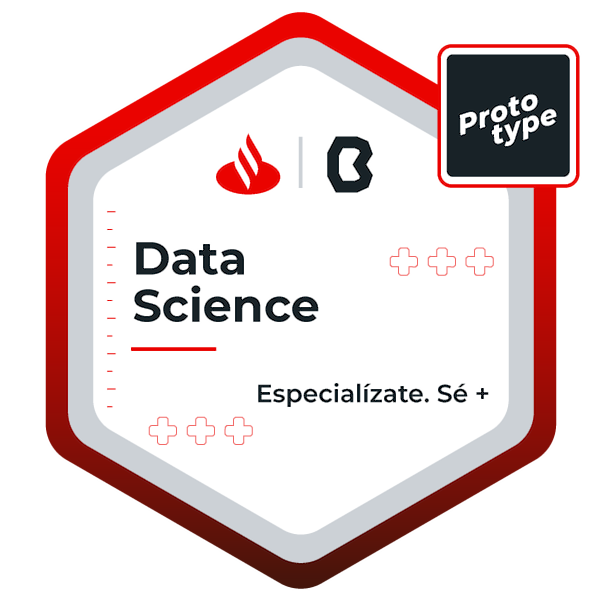

  

### 👨‍🎓 About Me 👨‍🎓
I'm a student in ESCOM, despite my great fascination with electronics, in recent years I have dedicated much of my time to specialize in Data, from DB management, exploratory analysis, predictions models, Machine Learning models, I have even made image analysis for disease detection and emotion classification.

I'm a great computer enthusiast, I've been in academic excellence for two and a half years, and I have a Santander scholarship in Data Science.

My countries besides computers are motorsport, I am a big fan of Formula 1, I also like to cook and collect cacti.

### 👨🏻‍💻 Badges 👨🏻‍💻

  

### Proyects
#### 💖 Data Science Aplication (Artificial Love) 2021 💖
Imagine using a dating application, where you magically find a person who looks like the one you have always looked for, they also have the same favorite band, because now it is possible to find that person only with **Artificial Love**, because we know it's about chemistry, but statistics may help.

  

#### 😷 Covid 19 Detection with Machine Learning (CoronAImage) 2020 😷
This is a project that thanks to the detection of patterns generated by a convolutional neural network, is capable of detecting with an accuracy of 97.73% * patients affected by the coronavirus SARS-CoV-2 (COVID-19) receiving as input a photograph of the chest of a patient, using a web application as an interface.

  

#### 🚘 Collective Transport Application for Companies and Schools (OptiSafe) 2020 🚘
We know that traveling in a city like CDMX can be dangerous, that is why we designed an application that helps you reach your destination for your work or school colleagues
**Note**: This project is made in order to economically analyze its feasibility, it was developed in the subject "Project Management"

  

#### 🤖 Artificial Intelligence and Data Science Mini Proyects 2020 🤖
I consider AI to be one of the most important technologies today, that is why I have dedicated myself to researching the most important algorithms in different sources and I have made several notebooks that you can check in my repository (click on the image).

  

#### 🖲 Digital Design Projects 2021 🖲
As a technician in Digital Systems, I have carried out several projects, but in the following repository are the most important ones that I did while studying at ESCOM, some of these projects are carried out in the remote laboratory of the school.

  

<h3> 🤝🏻 Connect with Me 🤝</h3>

    

  
